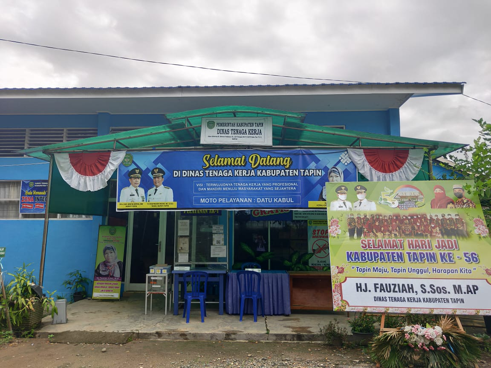

## About Application

Aplikasi Dinas Tenaga Kerja Kabupaten Tapin

- Beranda
- Data Master
    - Kecamatan
    - Pendidikan
    - Masyarakat
- Pencari Kerja
- Pelatihan Kerja
- Lowongan Kerja
- Laporan

## Cara Install

install terlebih dahulu composer <a href="https://getcomposer.org/">di sini</a>, dan juga install git <a href="https://git-scm.com/download/win">di sini</a>.
setelah itu pergi ke foleder tempat anda ingin menyimpan source code aplikasi,biasanya di htdocs. Terus klik kanan pada mouse dan cari <b>git bash</b> setelah itu ikuti petunjuk di bawah secara bertahap.

- ketikkan : git clone https://github.com/ChairulAnamProgramming/PKL_THALIA_18630252.git
- setelah git clone selesai, ketikkan <b>cd PKL_THALIA_18630252</b>  di git bash
- ketikkan : cp .env.example .env
- ketikkan : composer install (tunggu sampai selesai)
- ketikkan : php artisan key:generate
- buka text editor kalian :Sublime Text, Visual Studio, Atom (Pilih Salah Satu).
- buka folder PKL_THALIA_18630252 menggunakan text editor kalian.
- Cari file .env
- sesuaikan DB_DATABASE di file .env dengan database yang telah anda buat di phpmyadmin 
- ketikkan : php artisan migrate
- ketikkan : php artisan tinker
- ketikkan : php artisan storage:link
- ketikkan : User::factory()->create();
- Done

# Catatan
jika ingin update aplikasi, ketikkan <b>git pull</b> , setalah itu biasanya github meminta username & password anda.
